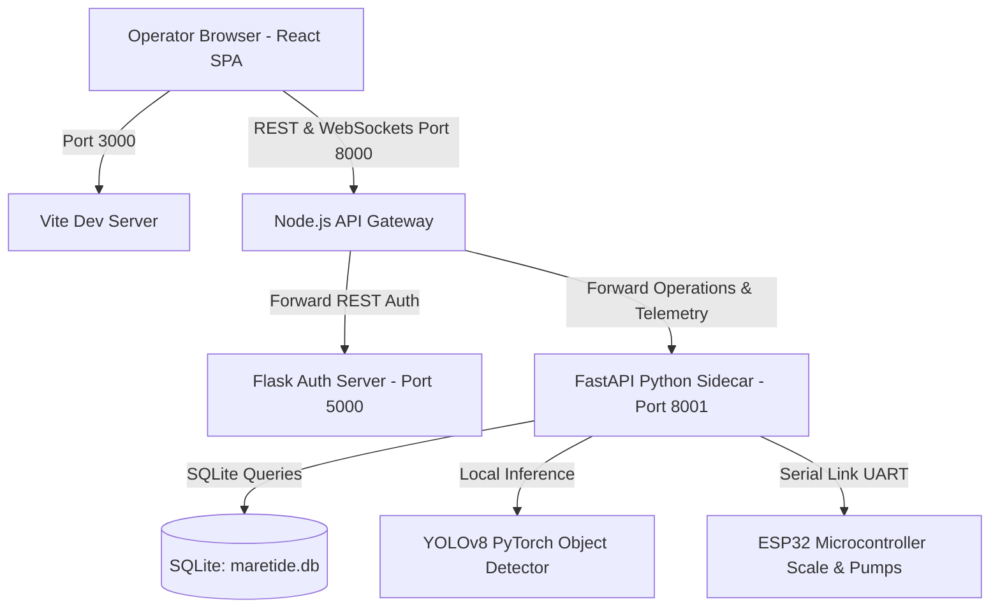
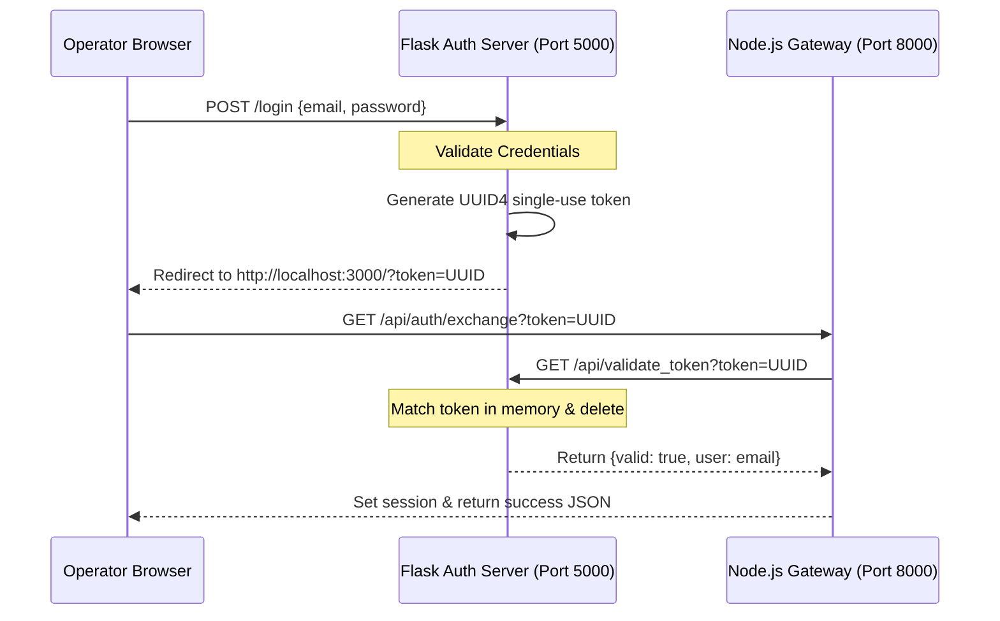
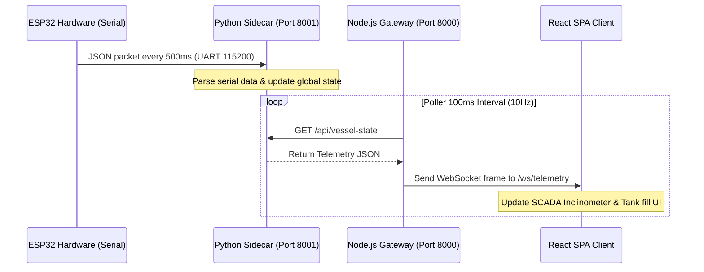
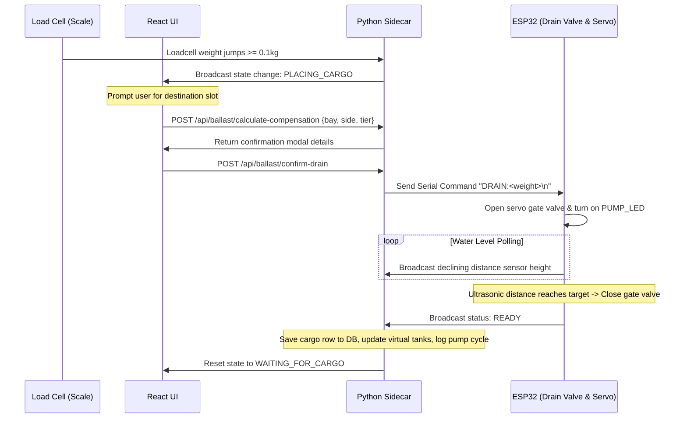

# SYSTEM ARCHITECTURE & BLUEPRINT

This document provides a detailed blueprint of the system architecture, database design, API endpoints, microservices coordination, and operational data flows.

---

## 1. System Architecture Layout



---

## 2. Microservices Directory Structure

*   **Vite React SPA (`dashboard_react/`)**: A client-side Single Page Application utilizing Leaflet maps, Tailwind CSS grids, and interactive SVGs for real-time SCADA telemetry display.
*   **Express Gateway (`backend_node/`)**: A proxy gateway. Its main function is to handle user authentication checks against the Flask server, proxy API requests to the Python sidecar, and broadcast telemetry state updates to the React client via WebSockets at 10Hz.
*   **FastAPI Sidecar (`sidecar_python/`)**: The core computation engine. Handles physics calculations (heel, trim, TCG, LCG, metacentric height), manages physical serial COM ports, controls OpenCV/YOLOv8 threads, and logs operations to SQLite.
*   **Flask Auth Server (`server.py`)**: Manages secure session cookies and signs single-use validation tokens to securely bridge cross-port redirects.

---

## 3. Core Database Schemas

### Operational Database (`sidecar_python/maretide.db`)

#### 1. Table `cargo_operations`
Stores the manifest of containers loaded onto the vessel deck.
```sql
CREATE TABLE cargo_operations (
    id INTEGER PRIMARY KEY AUTOINCREMENT,
    timestamp TEXT,         -- ISO-8601 formatting
    event TEXT,             -- e.g. "LOAD" / "UNLOAD"
    container_id TEXT,      -- Alpha-numeric identifier
    weight REAL,            -- Weight in metric tonnes (t)
    bay INTEGER,            -- Bay number (1 to 4)
    side TEXT,              -- "port" / "starboard" / "center"
    tier INTEGER,           -- Stack tier height (1, 2, ...)
    source TEXT             -- "ESP32" or "Simulation"
);
```

#### 2. Table `ballast_operations`
Tracks pump activations, transfers, and fluid level shifts.
```sql
CREATE TABLE ballast_operations (
    id INTEGER PRIMARY KEY AUTOINCREMENT,
    timestamp TEXT,         -- ISO-8601 formatting
    op_type TEXT,           -- "Drain" / "Transfer" / "Fill"
    pump_mode TEXT,         -- "Automatic" / "Manual"
    source TEXT,            -- Source tank key (e.g. "PORT-1") or "Manual Input"
    dest TEXT,              -- Destination (e.g. "Sea" or "STARBOARD-1")
    qty REAL,               -- Volume transferred (tonnes)
    remaining_src REAL,     -- Remaining volume in source tank
    final_dest REAL,        -- Final volume in destination tank
    score_before REAL,      -- Stability score before pump cycle
    score_after REAL,       -- Stability score after pump cycle
    trigger_source TEXT     -- "AI" or "User"
);
```

### AI Vision Database (`navi_vision/vision_alerts.db`)

#### 1. Table `vision_alerts`
Logs security intrusions and bow collision alerts.
```sql
CREATE TABLE vision_alerts (
    id INTEGER PRIMARY KEY AUTOINCREMENT,
    category TEXT NOT NULL,       -- "Cargo" / "Ballast" / "Crew Safety" / "Sea"
    severity TEXT NOT NULL,       -- "INFO" / "WARNING" / "CRITICAL" / "EMERGENCY"
    confidence REAL NOT NULL,     -- Object prediction score (0.0 to 1.0)
    message TEXT NOT NULL,        -- Alert description
    recommendation TEXT NOT NULL,  -- Actionable safety step
    camera TEXT NOT NULL,          -- Camera feed name
    timestamp REAL NOT NULL       -- Unix epoch float
);
```

---

## 4. Key Interface Workflows

### 1. Single-Use Token Auth Exchange


### 2. Live Telemetry WebSocket Loop


### 3. Automated Ballast Draining & Cargo Loading Sequence


---

## 5. Visual SCADA Component Specifications

### 1. Inclinometer SVG
*   **Static Elements**: Scale dial ticks drawn as an arc from -15° to +15°. The centerline indicator remains perpendicular to the base.
*   **Dynamic Elements**: Outer vessel hull profile rotates dynamically using `transform: rotate(roll_degrees)`. The hull outline path transitions dynamically between:
    *   `#10b981` (Green - Heel <= 2.0°)
    *   `#f59e0b` (Amber - Heel <= 5.0°)
    *   `#E7594B` (Red - Heel > 5.0° - Critical alert threshold)

### 2. SCADA Digital Twin Hull SVG
*   **Compartment Layout**: 8 rectangular blocks representing Port and Starboard ballast tanks across Bays 1 to 4.
*   **Fluid Level Overlays**: Generates sky-blue filled water layers inside the compartment coordinates, adjusting heights dynamically via the `fill_ratio` property:
    $$\text{fillHeight} = \text{svgHeight} \times \text{fill\_ratio}$$
*   **Metric Texts**: Displays active percentages (e.g. "85%") and current calculated volumes (e.g. "255t") with high-contrast text dropshadow overlays.

---

## 6. Integration Specifications

### 1. MyShipTracking AIS Integration
*   **Query URL**: `https://datadocked.com/api/vessels_operations/get-vessel-location`
*   **Auth Method**: API token passed via `x-api-key` header.
*   **Response mapping**: Parses JSON coordinate envelopes into `VesselPosition` instances (vessel name, mmsi, imo, lat, lng, speed, course, ETA, destination, draft, lastPort).
*   **Credits Fallback**: If credit limits are exceeded or key is rejected, it calls `get_mock_vessel(imo)` to return simulated coordinate trajectories.

### 2. ESP32 Serial protocol
*   **Output JSON format (ESP32 -> PC)**:
    `{"roll": 0.12, "pitch": -0.05, "distance": 14.22, "ballast_pct": 78.9, "cargo_kg": 12.35, "status": "STANDBY", "risk": "SAFE"}`
*   **Input Command format (PC -> ESP32)**:
    `DRAIN:<weight_kg>\n`
